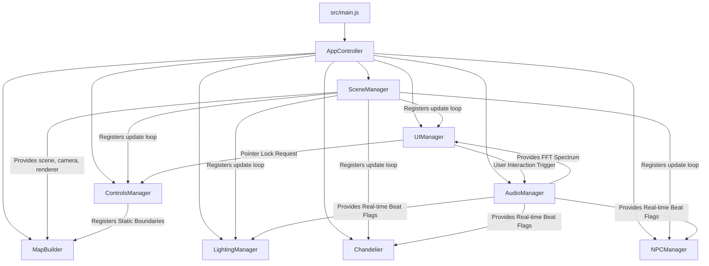

# 🪵 Hearthside Lounge & Botanist Bar: Architecture & Technical Guide

Welcome to the **Hearthside Lounge & Botanist Bar** developer guide. This document provides a highly detailed, comprehensive deep dive into the inner workings, mathematics, synthesis rules, and architectural patterns of our asset-free procedural 3D cozy retreat.

The entire experience relies on a **100% procedural pipeline**—meaning there are zero external audio tracks, images, or assets loaded from the network. Every model is built using geometric primitives, every texture is rasterized on the fly using HTML5 canvases, and every beat is synthesized in real-time through the Web Audio API.

---

## 🗺️ Architectural Blueprint

The application is engineered using a highly decoupled, modular, and event-driven manager pattern. `src/main.js` creates the app controller, and `src/core/AppController.js` owns manager construction, updatable registration, the frame-capped tick lifecycle, and disposal.



### Subsystem Flow & Interactions

1. **Bootstrap Phase**: `src/main.js` is loaded as an ES module. It calls `createAppController()`, passes browser lifecycle dependencies, exposes debug globals, registers `beforeunload` disposal, and starts the app.
2. **Construction Phase**: `AppController` instantiates `SceneManager`, `AudioManager`, and `ControlsManager`, then asks `MapBuilder` to compile materials, build geometry, and register bounding boxes (`THREE.Box3`) with `ControlsManager`. `LightingManager`, `Chandelier`, `NPCManager`, and `UIManager` are initialized with their dependencies.
3. **Registration Phase**: `AppController` registers updatable nodes inside `SceneManager`, including a coordinate observer that passes camera position into `AudioManager.setPlayerPosition()`.
4. **Interaction Trigger**: When the player clicks **"ACCEPT INVITATION & ENTER"** on the parchment ticket overlay, the Web Audio Context is started. The `UIManager` hides the overlay and requests pointer lock on the canvas, kicking off player navigation and procedural track playback.
5. **Tick Phase**: `requestAnimationFrame` drives the game loop through `AppController`. It calculates the frame delta ($dt$), clamps it to a maximum of $100\text{ms}$ to prevent physics tunnel-through on tab blur, and tells `SceneManager` to run `update()` on all registered modules.
6. **Disposal Phase**: `AppController.dispose()` stops the frame loop, cancels pending animation frames, and calls `dispose()` on managers that expose it so browser teardown and tests can clean up deterministically.

---

## 🛠️ Subsystem Deep Dives

### 1. AppController (`src/core/AppController.js`)

Coordinates construction, update registration, frame scheduling, debug global exposure, and cleanup.

- **Dependency Injection Boundary**: `createAppController()` receives factories for each manager and browser functions such as `requestAnimationFrame`, `cancelAnimationFrame`, and `now`. This keeps lifecycle behavior testable without constructing a real WebGL renderer.
- **Central Updatable Registry**: The controller registers `ControlsManager`, `LightingManager`, `Chandelier`, `NPCManager`, `UIManager`, and a coordinate observer with `SceneManager`. The coordinate observer is what keeps room-based acoustic filtering synchronized with the camera position.
- **Lifecycle Control**: `start()` begins the animation loop once, while `dispose()` stops future frames and disposes managers in reverse ownership order where possible.

---

### 2. SceneManager (`src/core/SceneManager.js`)

Responsible for establishing the WebGL view, camera parameters, tone-mapping, color space, and a smooth warm foggy atmosphere.

- **Field of View (FOV)**: Configured at $65^\circ$. This mimics a natural human indoor first-person perspective, preventing extreme wide-angle distortion at screen edges while maintaining spatial awareness.
- **Retina & High-DPI Optimization**: The pixel ratio is capped at `Math.min(window.devicePixelRatio, 2)`. This maintains sharp, crystal-clear graphics on Retina displays while preventing rendering performance degradation on high-resolution screens (like 4K and 5K monitors).
- **Fog Formula**: Implements Exponential Squared Fog (`THREE.FogExp2`) with an initial color value of `#0a0807` (cozy warm charcoal) and an initial density of $0.028$. The exponential fog calculation is:
  $$\text{fogFactor} = e^{-(\text{distance} \times \text{density})^2}$$
  This mimics a soft, fireplace-lit smoke/haze, creating depth, softening hard low-poly edges, and smoothly blending objects into the dark background at distance.
- **Dynamic Atmosphere Engine**: Integrates an real-time atmosphere scheduler (`_updateDynamicAtmosphere(dt)`) that reads the player's camera position along the X-axis and smoothly interpolates (`THREE.Color.lerp`) the renderer background color, fog color, and fog density across three distinct geographic zones:
  1. **Exterior (Cobblestone Street / West)** ($x < -4.8$): Configured to use a warm, dusty copper-orange sunset sky (`0x4c2b1a`) with a lighter fog density of $0.018$ to allow a clear, sharp view of the low-angle setting sun and long, atmospheric shadows.
  2. **Reception Gateway (Transition Lobby)** ($-4.8 \le x < 1.0$): Transitionary warm timber/copper glow sky (`0x16100d`) with a mid-fog density of $0.024$.
  3. **Lounge Interior (Acoustic Hall / Lounge / Bar)** ($x \ge 1.0$): Cozy dim charcoal (`0x0a0807`) with a dense fog factor of $0.028$.

  The interpolation is governed by exponential decay on every tick:
  $$\text{Color}_{t+dt} = \text{lerp}(\text{Color}_t, \text{Color}_{\text{target}}, 3.5 \times dt)$$
  $$\text{Density}_{t+dt} = \text{Density}_t + (\text{Density}_{\text{target}} - \text{Density}_t) \times 3.5 \times dt$$
  This produces a flawless cinematic fade as the player walks past the doorman's podium, through the heavy double-doors, and onto the warm hardwood floor.

- **Tone Mapping & Shadowing**: Tone mapping is set to `THREE.ACESFilmicToneMapping` with an exposure of `1.0` to achieve rich, high-contrast candle glows. Soft shadows are enabled via `THREE.PCFShadowMap` for rich volumetric depth under warm hanging lanterns and candle sconces.

---

### 3. ControlsManager (`src/core/ControlsManager.js`)

A robust first-person player controller implementing mouse-look, inertial movement, and an independent-axis wall-sliding collision engine.

- **Camera Order**: Explicitly set to `'YXZ'`:
  ```javascript
  this.camera.rotation.order = 'YXZ';
  ```
  This is a critical requirement for first-person camera controllers. By calculating horizontal rotation (Yaw, around Y-axis) before vertical rotation (Pitch, around X-axis), we completely prevent **gimbal lock**, allowing seamless, natural mouse look.
- **Euler Clamping**: The vertical look angle is clamped to $\pm 1.48$ radians ($\approx 85^\circ$) to prevent the camera from flipping upside down:
  ```javascript
  this.camera.rotation.x = Math.max(-1.48, Math.min(1.48, this.camera.rotation.x));
  ```
- **Movement Integration**: Tracks player acceleration and applies friction damping. The differential equation for velocity is integrated using Euler step approximations:
  $$v_{t + dt} = v_t + (a - f \cdot v_t) \times dt$$
  where $a$ is the input acceleration vector (base acceleration configured at $20.0\text{ m/s}^2$ for snappier, 25% faster default movement), $f$ is the friction coefficient ($10.0$), and $dt$ is the delta time. When keyboard input ceases ($a = 0$), velocity decays exponentially, providing a smooth sliding glide rather than abrupt stopping.
  - **Sprinting**: If the player holds down the `SHIFT` key, a sprint multiplier is applied, running at 1.25x speed. This lets players sprint across rooms or quickly move from the street sidewalk into the heart of the fireplace lounge.
- **Independent Axis Sliding Collisions**: Standard collision systems often stop player movement entirely if a boundary is intersected. To allow smooth "wall sliding," the controller evaluates and resolves collision boundaries independently for the $X$ and $Z$ axes:

  ```javascript
  // 1. Calculate tentative X position
  const targetX = currentPos.x + velocity.x * dt;
  const testBoxX = this._getPlayerBox(targetX, currentPos.z);
  if (!this._checkCollision(testBoxX)) {
    this.camera.position.x = targetX;
  } else {
    this.velocity.x = 0; // Stop X movement but keep Z velocity intact!
  }

  // 2. Calculate tentative Z position
  const targetZ = currentPos.z + velocity.z * dt;
  const testBoxZ = this._getPlayerBox(this.camera.position.x, targetZ);
  if (!this._checkCollision(testBoxZ)) {
    this.camera.position.z = targetZ;
  } else {
    this.velocity.z = 0; // Stop Z movement but keep X velocity intact!
  }
  ```

  This algorithm ensures that if a player walks diagonally into a wall, the blocked axis velocity is zeroed out, but they continue sliding smoothly along the wall on the free axis.

---

### 4. AudioManager (`src/core/AudioManager.js`)

The procedural acoustic lounge sound synthesis core. Uses the browser Web Audio API to schedule sounds, sequence notes, and apply spatial acoustic effects.

#### Synthesis Sub-Nodes Architecture

```
[Oscillator 1 / Noise] -\
                          --> [Sub Filter (Biquad)] --> [Local Gain Node] -\
[Oscillator 2 (Detune)] -/                                                  |
                                                                            v
[Master Synth Output] <--- [Master Gain] <--- [Analyser] <--- [Biquad Room Lowpass]
```

#### Step Sequencer

Synthesizes a live $80\text{ BPM}$ acoustic/jazz lounge score using a 16-step scheduler loop. The scheduler polls every $25\text{ms}$ with a lookahead buffer of $100\text{ms}$ to ensure high-accuracy audio timing.

- **Wooden Kick Drum Synth**: A warm heartbeat stomp synthesized via a low pitch-swept Sine wave:
  - Sweep: $100\text{ Hz}$ down to $32\text{ Hz}$ in $140\text{ms}$ using an exponential ramp (`exponentialRampToValueAtTime`).
  - Envelope: Soft volume decay from $0.65$ gain to $0.001$ over $180\text{ms}$ for a natural wood thump.
  - Triggers on steps $0, 4, 8, 12$ (Heartbeat meter).
- **Brushed Shaker Hi-Hat Synth**: Procedural white-noise brushed cymbals.
  - Buffer generation: Slices from a pre-allocated $50\text{ms}$ mono buffer (`AudioBuffer`) filled with randomized floating-point values between $-1.0$ and $+1.0$.
  - Filter: Passed through a bandpass `BiquadFilterNode` configured at $6500\text{ Hz}$ to simulate a soft organic brushed shaking tick.
  - Triggers on offbeats (steps $2, 6, 10, 14$) with low volume ($0.12$) to maintain a relaxing atmosphere.
- **Upright Double-Bass Synth**: A syncopated, walking woody bass line.
  - Waveform: Triangle wave passed through a dark $150\text{ Hz}$ low-pass filter.
  - Pattern: Notes ($C_1$, $F_1$, $G_1$, $A\#_1$) scheduled on syncopated walking steps.
  - Envelope: Long, soft attack ($30\text{ms}$) and organic exponential decay ($450\text{ms}$), replicating hand-plucked thick gut strings.
- **Rhodes-Style Electric Piano chords**: Dual-oscillator warm EP chord progressions.
  - Oscillators: Pure sine wave (fundamental body) mixed with a soft triangle wave (bell overtone at frequency $\times 2.01$) and a triangle sub-octave.
  - Chord Progression: Elegant minor-scale $C$-minor 7 and $G$-minor 7 chords scheduled with graceful filler notes on syncopated chords.
  - Envelope: Gentle attack ($40\text{ms}$ linear) and long, lush decay release ($800\text{ms}$) for warm acoustic resonance.

#### Acoustic Occlusion Engine

Tracks player coordinates and matches them against room boundary boxes, smoothly transitioning filter settings to mimic real-world acoustics.

| Room                     | Location Coordinates (Bounding Box)       | Target Lowpass Cutoff                      | Target Volume Coefficient |
| ------------------------ | ----------------------------------------- | ------------------------------------------ | ------------------------- |
| **Cobblestone Street**   | $x \in [-50, -4.8], z \in [-50, 50]$      | $280\text{ Hz}$ (Bass thumps only)         | $0.28$ (Highly muffled)   |
| **Reception & Coatroom** | $x \in [-4.8, 1.0], z \in [-50, 50]$      | $650\text{ Hz}$ (Muffled mid-tones)        | $0.55$ (Transitional)     |
| **Botanist Bar**         | $x \in [1.0, 13.0], z \in [5.5, 11.0]$    | $1800\text{ Hz}$ (Warm woodwork resonance) | $0.85$ (Clear)            |
| **Hearthside Lounge**    | $x \in [6.0, 19.0], z \in [-21.0, -10.5]$ | $1100\text{ Hz}$ (Warm fireside muffle)    | $0.65$ (Relaxing)         |
| **Acoustic Hall**        | Default fallback region                   | $20000\text{ Hz}$ (Full frequency)         | $1.00$ (Crisp, resonant)  |

- **Proximity Gain Scaling**: In the Acoustic Hall, the engine calculates the Euclidean distance between the player and the Turntable Console (located at $x = 18, z = 0$):
  $$\text{dist} = \sqrt{(18 - p_x)^2 + (0 - p_z)^2}$$
  The volume is attenuated based on proximity:
  $$\text{volumeMultiplier} = \text{clamp}(1.1 - \text{dist} \times 0.022, 0.68, 1.0)$$
  This provides a subtle, natural volume increase as you walk closer to the acoustic cabinets.
- **Audio Pop Elimination**: Snapping a filter cutoff frequency or gain node instantly causes a harsh clicking pop due to waveform discontinuity. To prevent this, the engine smoothly interpolates (lerps) the cutoff and volume on every frame:
  $$f_{\text{current}} = f_{\text{current}} + (f_{\text{target}} - f_{\text{current}}) \times 0.07$$
  $$v_{\text{current}} = v_{\text{current}} + (v_{\text{target}} - v_{\text{current}}) \times 0.07$$
  This 7% frame-rate-independent step ensures room crossovers sound smooth and organic.

---

### 5. TextureGenerator (`src/utils/TextureGenerator.js`)

Generates retro-style pixelated textures dynamically on HTML5 canvas elements at runtime.

- **Retro Filtering**: After drawing pixel art onto canvas elements, they are converted into Three.js textures with **Nearest-Neighbor** sampling. This prevents the GPU from smoothing the pixels, preserving a sharp, blocky 8-bit look:
  ```javascript
  texture.minFilter = THREE.NearestFilter;
  texture.magFilter = THREE.NearestFilter;
  ```
- **Dynamic Canvas Rasterization**:
  - `generateHardwoodFloor()`: Draws interlocking oak wood planks with horizontal board seams, randomized timber shading variations, and fine wood grain lines.
  - `generateBrickWall()`: Generates natural exposed clay bricks (terracotta/deep-rust red `#a25a42` with soft-grey mortar `#cac4b9`), incorporating top-left bevels and bottom-right shadow borders for 3D pixelated depth.
  - `generateTurntableConsole()`: Rasterizes warm wood veneer cabinets, rotating brass platters, sliding knobs, and glowing warm-lit analog needle VU meters.
  - `generateSpeakerCone()`: Styles speaker monitors with a rich walnut wood border and clean charcoal-black fabric grille cloth.
  - `generateNPCFace()`: Draws cozy pixel face maps with skin details, spectacles with thin golden rims, smiles, and warm hair styles.
  - `generateNPCOutfit()`: Weaves intricate cozy patterns: wool cream cable-knit cardigans, forest-green and navy plaid flannels, argyle patterns, and warm corduroy trousers.
  - `generateFramedArt()`: Renders hand-drawn botanical sketches, forest silhouettes, and warm landscape scenes inside polished mahogany frames.

---

### 6. MapBuilder (`src/world/MapBuilder.js`)

Translates the architectural coordinate system into concrete, layered meshes.

```
       [HEARTHSIDE LOUNGE]           [ACOUSTIC CORNER]
       (x: 6 to 19, z: -21 to -10)   (x: 18, z: 0)
                  |                        |
[EXTERIOR] -- [RECEPTION] ---------- [ACOUSTIC HALL]
(x: -25 to -5) (x: -5 to 1)          (x: 1 to 20, z: -10 to 5)
                                          |
                                    [BOTANIST BAR]
                                    (x: 1 to 13, z: 5 to 11)
```

- **Voxel Decanters & Bottles**: Spawns 15 individual voxel bottles and decanters. Bottles represent realistic amber whiskey, green herbal liqueurs, and clear glass decanters on back-bar shelves, illuminated by warm gold cove lights.
- **Oak Trellis Pergola**: The entrance features a beautiful rustic oak wooden trellis pergola adorned with trailing green ivy vines.
- **Herringbone Hardwood Floor**: Spawns an interlocking herringbone pattern of oak hardwood planks bordered by polished walnut timber frames, defining the central Acoustic Hall.
- **Classic Luxury Sedan**: A gorgeously detailed 1960s classic sedan model parked along the curb ($x = -13.5, z = -7.0$). It features a black chassis, a sleek British racing green body, a gleaming chrome grille, rotating wheels, and warm glowing amber bulb headlights.

---

### 7. LightingManager (`src/world/LightingManager.js`)

Creates flickering candle sconces, hanging gas lanterns, warm fireplace glows, and beautiful atmospheric environmental lights.

- **Upgraded Global Slate-Timber Gradients**: To resolve heavy crushing blacks, the engine establishes a slate-timber global `AmbientLight` (`0x16100d` at $0.45$ intensity) paired with a dual-tone sky/ground `HemisphereLight` (`0x2d1f18` copper-sky / `0x0f0c0a` dark floor reflections, at $0.65$ intensity). This lifts absolute shadows, letting architectural wood and brick details remain beautifully legible.
- **Golden Hour Sunset**: A low-angle warm `DirectionalLight` (`0xff6622`, $3.5$ intensity) is positioned in the far west at `(-25.0, 3.5, 2.0)`. It casts long, dramatic horizontal shadows of trees, trellis pillars, and rope barriers across the cobblestone pavement.
- **Dual-Lantern Reception Lighting**: To completely resolve darkness in the Reception & Coatroom, two physical hanging brass-rod lanterns are placed over the desk and seating bench, with corresponding point lights (`0xffaa3a`, intensity `2.0`) flickering dynamically to simulate gas flames.
- **Dual Fireside Sconces**: The Hearthside Lounge is illuminated by two physical wall-mounted candle sconces (brass backing plates and white candle cylinders) flanking the brick fireplace, paired with flickering point lights (`0xffaa3a`, intensity `1.8`) to eliminate shadows.
- **Decoupled Tick-Based Flickering**: Lighting flicker calculations for lanterns, sconces, and the fireplace are computed on independent, clock-based 70ms and 80ms interval timers. This ensures organic, asynchronous light sways across the room without performance degradation:
  ```javascript
  // Flickering based on elapsed clock interval
  if (time - this.lastFlickerTime > 0.07) {
    this.lastFlickerTime = time;
    this.lanternLight.intensity = 1.6 + Math.random() * 0.8;
  }
  ```

---

### 8. Grand Candle Chandelier (`src/world/Chandelier.js`)

A grand, slow-rotating wrought-iron candle ring chandelier suspended in the center of the Acoustic Hall.

- **Wrought-Iron Construction**:
  ```javascript
  const ringGeo = new THREE.CylinderGeometry(0.9, 0.9, 0.08, 16, 1, true);
  const ironMat = new THREE.MeshStandardMaterial({
    color: 0x1f1d1c, // Dark wrought-iron
    metalness: 0.6,
    roughness: 0.8,
  });
  ```
  The chandelier is detailed with 6 spokes, brass drip pans (`0xc5a059`), ivory candle cylinders, and flickering orange flame boxes.
- **Dynamic Beat-Synced Flaring**:
  The chandelier rotates slowly and bobs vertically:
  $$y = y_{\text{base}} + \sin(\text{time} \times 1.2) \times 0.08$$
  On synthesizer kick drum beats, the flame boxes scale up and flare in brightness. The chandelier releases 18 amber "spark" particles (`sparks`) that orbit the room, scaling up and flaring in opacity in sync with the soft wooden kick heartbeat.

---

### 9. NPCManager (`src/entities/NPCManager.js`)

Configures, rigs, and animates our blocky, voxel-art characters in cozy winter wear.

#### Dynamic Beat-Synced Cozy Routines

On every frame update, limbs are rotated using trigonometric equations driven by sequence beats to represent relaxed, natural conversation movements:

1. **The Chill Chatterer** (Side-to-side body sway, head turning left/right):
   - Torso sway: $rot_z = \sin(t \times 1.2 + \phi) * 0.08$
   - Head turning: $rot_y = \cos(t * 0.8 + \phi) * 0.25$
   - Arms sway gently: $rot_x = \sin(t * 1.2 + \phi) * 0.1$
2. **The Cozy Swayer** (Gentle torso nodding, hands on hips):
   - Hands on hips: Arms locked in waist position ($rot_z = \pm 0.45$, $rot_x = -0.1$)
   - Torso nodding: $rot_x = |\sin(t * 1.5 + \phi)| * 0.08$
3. **The Rhythmic Nodder** (Stationary body with clear head nods and foot-tapping):
   - Head nodding: $rot_x = \sin(t * 2.0 + \phi) * 0.2$
   - Foot-tapping: $rot_x = \max(0, \sin(t * 4.0 + \phi)) * 0.15$ for the left leg group.
4. **The Conversationalist** (Slow body weight shifting, active hand gestures):
   - Arm gesturing: Right arm swings up and down organically ($rot_x = -0.5 + \sin(t * 1.0) * 0.25$) while left arm sways.
   - Gentle weight shifting: $rot_y = \sin(t * 0.6 + \phi) * 0.12$.

---

## 📹 Automated Visual Verification & Recording System

To perform high-fidelity visual regression audits, coordinate testing, and capture cinematic presentations without manual browser interaction, the codebase includes a robust Puppeteer-driven automation suite.

### 1. Multi-Room Snapshot Auditor (`take_screenshots.js`)

Captures static, high-resolution orthographic and perspective angles of the primary rooms to evaluate lighting, shadow maps, and material layouts.

- **Usage**:
  ```bash
  npm run qa:screenshots
  ```
- **Execution Flow**:
  1. Spins up a headless Chrome instance using Puppeteer.
  2. Navigates to `http://localhost:5173/` and automates a mouse click on the entry button to activate Three.js and the Web Audio context.
  3. Pauses for 4 seconds to allow the procedural geometry to compile, materials to render, and audio-reactive buffers to initialize.
  4. Automatically relocates the player camera and target vector to 5 key positions: **Exterior Facade**, **Cloakroom Reception Desk**, **Botanist Bar**, **Fireplace Lounge**, and the **Acoustic Hall Parquet Floor**.
  5. Forces rendering pipelines (`updateMatrixWorld` and `updateProjectionMatrix`) to refresh and writes `.png` screenshots of each frame.

### 2. Full-Sequence Tour Frame Capture (`record_tour.js`)

Generates a structured, 12-frame step-by-step traversal sequence of the entire retreat, matching specific key points used to construct the multi-slide carousel in our walkthrough reports.

- **Usage**:
  ```bash
  npm run qa:tour
  ```

### 3. Continuous Cinematic WebM Recorder (`record_video.js`)

Captures a fully continuous, high-definition (720p @ 30fps) walking video walkthrough of the retreat using the HTML5 `MediaRecorder` API directly on the canvas stream.

- **Usage**:
  ```bash
  npm run qa:video
  ```
- **Technical Details**:
  - **Player Override**: Temporarily unregisters the keyboard/mouse `ControlsManager` updatable from the central `SceneManager` tick array, enabling the automation scripts to assert absolute control over camera matrices.
  - **Camera Interpolation**: Installs a cinematic controller that smoothly pans the camera positions and look vectors between the 12 key positions over a 27.5-second timeline using a cosine interpolation function:
    $$f(x) = \frac{1 - \cos(\text{fraction} \cdot \pi)}{2}$$
    This produces organic easing and deceleration on transitions, replicating a professional camera operator or dolly rig.
  - **Canvas Encoding**: Attaches a `MediaStream` directly from the WebGL canvas using `canvas.captureStream(30)`. Feeds the stream into a native `MediaRecorder` instance with a priority target codec of `video/webm;codecs=vp9`, falling back to standard `video/webm` on older environments.
  - **Data Compilation**: On completion of the 27.5-second sequence, the recorder stops, compiles the video chunks into a single WebM Blob, base64 encodes the binary content, and passes it back to Puppeteer to write directly to disk as `walkthrough.webm`.

---

## ⚡ Performance Optimizations & Resilience

1. **Delta Time Clamping**:
   ```javascript
   const dt = (currentTime - lastTime) / 1000;
   sceneManager.update(Math.min(0.1, dt));
   ```
   If a user switches browser tabs, the animation frame loop is paused by the browser. Clamping $dt$ to $100\text{ms}$ ensures collision bounding box integrity is maintained under all conditions.
2. **Zero-Allocation Audio Synthesizer Loop**:
   Pre-allocated white noise buffers and static filters in `src/core/AudioManager.js` eliminate real-time object allocation and garbage collection overhead, preventing audio dropouts or micro-stutters during execution.
3. **Disposal & Garbage Collection**:
   Managers that allocate browser or Web Audio resources expose a `dispose()` method, and `AppController.dispose()` calls it when present. This closes audio contexts, stops timers, clears intervals, and tears down renderer state without requiring every scene object to implement the same API.

---

## 🛡️ Maintenance QA Checklist

- [ ] Run `npm run dev` to launch the hot-reloading development server.
- [ ] Verify that clicking the "ACCEPT INVITATION & ENTER" button activates audio playback and hides the ticket modal.
- [ ] Test movement collision: Walk directly into the classic sedan, doorman's podium, bar stools, brick fireplace, and seating furniture to ensure you slide smoothly.
- [ ] Test acoustic occlusion: Walk through the venue rooms and listen to the audio filter. The sound should transition smoothly from muffled thumps (Cobblestone Street) to muffled mid-tones (Reception), clear warm acoustics (Botanist Bar), and cozy fireside low muffle (Hearthside Lounge).
- [ ] Run `npm run test`, `npm run lint`, and `npm run format:check` before merging code changes.
- [ ] Run `npm run build` to verify the production bundle compiles with zero tree-shaking or minification errors.
- [ ] Use `npm run qa:screenshots`, `npm run qa:tour`, and `npm run qa:video` for visual regression snapshots and walkthrough capture when changing scene layout, lighting, camera flow, or materials.
